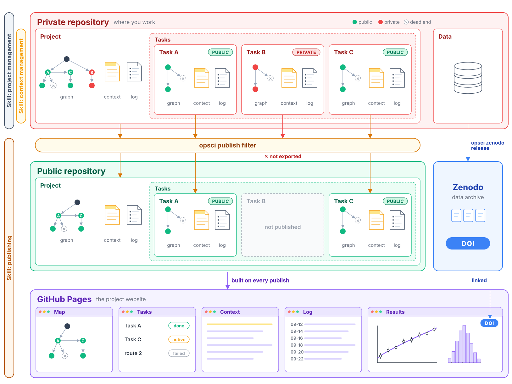

# open-science

The way we do science is changing rapidly, but it is more important than ever to keep
science open.

open-science is a framework for doing research in the open:

- **A complete research record.** How the methods were developed, the results, the
  approaches that failed, and the source code, in a public repository and on a project
  website, with the data archived on Zenodo with a DOI.
- **You decide what goes public, and when.** You work in a private repository and can mark
  any task, file or dataset as private. Nothing is released until you choose to publish.
  Each release contains only the files you allow, is checked for private material and
  secrets, and needs your approval.
- **Context management for agentic work.** Agents keep a short context file for the project
  and for each task, so any new session, a collaborator or another researcher can pick up
  an ongoing project straight away. Optionally, agents also clear their conversation on
  their own and resume from that file ("session jumps"), so a long session is not resent in
  full on every turn or after the prompt cache expires, which reduces usage.
- **Work your way.** Use plain files and the `opsci` command yourself, or use the optional
  Claude Code and Codex plugins. The research record and publication checks are shared.



**Start with the [tutorial](docs/tutorial.md).** The full documentation is at
<https://mhycheung.github.io/open-science/> (source in `docs/`).

## Install

If you use Claude Code, install the plugin and start Claude Code:

```bash
claude plugin marketplace add mhycheung/open-science
claude plugin install open-science@open-science
claude
```

Then type `/open-science:onboard`. The [tutorial](docs/tutorial.md) says what onboarding
does and gives the prompts for the next steps: starting a project, brainstorming, starting a
task and using Notion.

For Codex:

```bash
codex plugin marketplace add mhycheung/open-science
codex plugin add open-science@open-science
codex
```

Ask Codex to use `open-science:onboard`. Restart after installing components and review
their hooks with `/hooks`. See [Claude Code and Codex](docs/agents.md) for setup,
shared workflows, and the differences in session controls.

If you are not using agents, install the `opsci` command
(`pip install "git+https://github.com/mhycheung/open-science#subdirectory=tools"`, see
[The opsci command](docs/cli.md)) and follow the pages of the components you want (below).

The framework has three components. Use any combination; each works without the others,
except context management, which needs project management.

| # | component | plugin | what | needs |
|---|---|---|---|---|
| 1 | project management | `open-science-project` | the project template: description, tasks, map, sources, rules, context files and their caps (`new-project`, `new-task`, `context-files`, `migrate-project`, `update-from-template`, `private-investigation`) | git, `opsci` |
| 2 | context management (for agents) | `open-science-context` | agents keep the context files current and take over a task from them; optionally, they clear their own conversation and resume from those files (`context-management`, `continue-context`, `advise-with-context`). Codex: see [Claude Code and Codex](docs/agents.md) | project management (installed with it), Claude Code running inside tmux (Codex: tmux only for jumps), `opsci` |
| 3 | publishing | `open-science-publish` | a private and a public copy of each project; a checked, approved export; a project site; Zenodo releases (`publish`, `zenodo-release`) | git, `opsci`, a GitHub account; any git repository |

There are also two [optional extras](#optional-extras).

Context management needs Claude Code to run inside tmux; the
[tmux guide](docs/tmux.md) shows how to set it up, including on a cluster's compute node.
Codex needs tmux only for session jumps; see [Claude Code and Codex](docs/agents.md).

## Optional extras

Both are in `extras/`, and nothing in the three components depends on them.

| extra | where | what | needs |
|---|---|---|---|
| projects list | `extras/projects-page/` (no plugin) | one page on your personal GitHub site listing your projects | a GitHub Pages site; `opsci` only to check the file |
| SLURM resurrection | plugin `slurm-resurrect`, in `extras/slurm-resurrect/` | for development on a compute node of a computing cluster that uses the SLURM scheduler: when the batch job reaches its time limit, rebuild the tmux session in a new job and resume its Claude Code and Codex sessions; see `extras/slurm-resurrect/README.md` | a SLURM cluster, with tmux and Claude Code or Codex running inside a batch job; `jq`, `flock`, `setsid`, `sbatch`, `squeue`, `scancel` |

## What is in this repository

| path | what |
|---|---|
| `template/` | the project skeleton that a new project is copied from |
| `plugins/` | optional Claude Code and Codex plugins: `open-science` (onboarding) and one per component |
| `extras/` | the optional extras: the projects page and the `slurm-resurrect` plugin |
| `tools/` | the `opsci` Python package and command line (map build, publish, sync, Zenodo, notify, site) |
| `tests/` | `tests/run_all` runs every automated test |
| `docs/` | the documentation website (`mkdocs.yml`), one page per component |
| `docs/design/` | the design report, the original request, the build plan, and the verification results |
| `CHANGELOG.md` | what each release changed, and how to migrate a project to a new layout |

## Choices recorded here

- **Command-line name: `opsci`** (short for "open science").
- **Environment: [pixi](https://pixi.sh).** `pixi.toml` pins Python ≥3.11 and the test
  dependencies; `pixi.lock` records the exact versions. `pixi run test` runs the tests.

## The `opsci` command

| command | what |
|---|---|
| `opsci template instantiate` | copy the project template into a new directory |
| `opsci task new` | create a task directory, optionally with a plan |
| `opsci map build` | build the project graph and the list of dead ends from the node headers |
| `opsci context check` | check the context files against their line caps |
| `opsci publish` | export, check and push the public part of a project |
| `opsci site` | build the project site |
| `opsci zenodo` | release data to Zenodo (sandbox by default); see `docs/zenodo.md` |
| `opsci notify` | send a message, and optionally a file, to the user; see `docs/notify.md` |
| `opsci notion` | mirror a project into Notion and post to its Feed; see `docs/notion.md` |
| `opsci projects-page` | check the personal projects page |
| `opsci migrate` | check that a migration lost no file |
| `opsci guide check` | check that the user guide is short and names only things that exist |

`opsci <command> --help` gives the options; `tools/README.md` describes each command.

## Licences

Code: MIT (`LICENSE`). Documentation and other text: CC BY 4.0 (`LICENSE-docs`).
