# Context management and session jumps (`open-science-context`)

Claude Code's session controls are described first below. Codex shares the same context
files and handoff skills, with its own [session controls](#codex-session-controls).

An agent can hold only a limited amount of conversation. On long work it would otherwise
slow down or lose track. With the `open-science-context` plugin, the agent saves where the
work stands in the project's context files, clears its own conversation, and carries on from
those files. This is called a **jump**. You will see the agent type into its own tmux pane;
that is expected.



Left: the context is over 250k tokens, so the agent saves its state to the task's context
file and the plugin clears the session and resumes it from that file. Right: the agent
submits a SLURM job, saves its state and clears; the idle session is woken when the job
leaves the queue and resumes from the context file. Clearing before a long wait matters
because the prompt cache expires while the session sits idle: waking a session that still
holds a long conversation would resend all of it uncached, which costs far more than a
fresh start from the context file.

The figure and cache-expiry explanation describe Claude Code. Codex does not use the
Claude cache-cold timer or its fixed context thresholds.

**Jumps are optional.** Without them, the plugin still registers each pane to its context
file, the agents still keep the context files current, and any session can take over a task
with `open-science-context:continue-context`. See [Choosing which jumps](#choosing-which-jumps).

```bash
claude plugin install open-science-context@open-science
```

Installing it also installs `open-science-project`: a jump is only as good as the context
file it resumes from. It needs `jq`, `opsci`, and tmux.

**Claude Code must run inside tmux.** A jump types into the agent's own tmux pane, and each
pane records which context file it drives. Outside tmux, `jump.sh` refuses and the Stop hook
does nothing. [Working in tmux](tmux.md) shows how to arrange your work (one pane per task),
how to set tmux up for the mouse, and how to run it on a compute node of a cluster.

| skill | use it to |
|---|---|
| `open-science-context:context-management` | the rules for jumps, pane registration and subagent checkpoints; main agents load it at session start |
| `open-science-context:continue-context` | take over the work a context file describes; the first step after every jump |
| `open-science-context:advise-with-context` | ask questions about a context file or plan without acting on it |

## Pane registration

Each tmux pane records which context file it drives, so that
`open-science-context:continue-context` finds the right file after a jump with no file named.
When the main agent starts driving a task it runs:

```bash
bash "${CLAUDE_PLUGIN_ROOT}/scripts/pane_context.sh" set tasks/<id>/context.md
```

`pane_context.sh get` prints the registered path, and `pane_context.sh clear` drops it. A new
session in the same pane (after a jump, a SLURM resurrection or a plain `/clear`) keeps the
registration. Subagents never register; they use the main agent's pane.

To take over work in a pane yourself, type `/open-science-context:continue-context`, with or
without a file. With no file it uses the pane's registered file and prints which one; with
nothing registered it lists candidates, newest first, and asks you. **Typing it in the wrong
pane resumes the wrong work**, so check the line that names the file.

## Jumps

| jump | when | command |
|---|---|---|
| active | the context is above about 250k tokens, a subtask finished, or before a fan-out of subagents | `bash "${CLAUDE_PLUGIN_ROOT}/scripts/jump.sh" active <context file>` |
| wait | only background work is left (subagents, a background shell, a SLURM job) and it will take longer than about 45 minutes | `bash "${CLAUDE_PLUGIN_ROOT}/scripts/jump.sh" wait <context file>` |
| cache-cold | the plugin types `[open-science] cache-cold: ...` into the pane after 45 minutes idle with work still running | a wait jump, now |

Before either command, in the same turn, the agent writes the jump's record: the task
`context.md` (state, what is in flight and how to check it, the exact next step), the project
`context.md` if it changed, one line in the task log, and `opsci notify` for anything you
would otherwise miss. The `jump.sh` call is the last action of the turn.

When the turn ends, the plugin's Stop hook starts the jump: it waits for the pane to be idle,
types `/clear`, confirms that the session id changed, and, for an active jump, types
`/open-science-context:continue-context <context file>`. The agent never types into its own
pane itself.

A cleared session is woken by a background subagent's report, a background Bash task
exiting, or a Monitor event. For SLURM jobs the agent starts a waker before a wait jump:
`bash "${CLAUDE_PLUGIN_ROOT}/scripts/wait_slurm.sh" <jobid> [<jobid>...]`.

### When the agent does not jump

- **While it waits for you.** If the turn ends with a question, a decision or a hold point,
  the agent saves the state, asks, and ends the turn, whatever the context size. It jumps
  after you answer, if work is left.
- **As a subagent.** Subagents never jump.
- **While another component owns the pane**, for example SLURM resurrection during its
  wind-down.

### What `jump.sh` refuses

| refusal | why |
|---|---|
| `OPSCI_JUMPS` is `off`, or `wait` for an active jump | you switched these jumps off |
| not in tmux | the jump types into the pane |
| the context file is missing, or was not saved in the last 15 minutes | the state to resume from was not written |
| the session's state file cannot be found | the clear could not be confirmed |
| an active jump below 100k tokens without `--force` | a jump costs a full reload; small contexts do not need one |
| an inhibit file exists | another component owns the pane |
| at the stop: a wait jump with nothing running that could wake the session | the session would never wake; start the waker or do an active jump |

`jump.sh cancel` drops a pending request; `jump.sh status` shows it.

### The Stop hook

At every stop of a main session inside tmux, the Stop hook:

1. starts a pending jump, or refuses a wait jump that nothing would wake;
2. arms the cache-cold timer if something will wake the session (a running background task
   or a scheduled prompt), and stops it otherwise;
3. if the context is above the threshold (250k tokens) and no jump is pending, blocks the
   stop once with an instruction to do an active jump. It blocks the same session again only
   after its context has grown by another 50k tokens, so a session waiting for you is not
   stopped at every reply.

Outside tmux it does nothing. With `OPSCI_JUMPS=wait` it skips step 3; with
`OPSCI_JUMPS=off` it only stops a leftover timer.

### Choosing which jumps

Onboarding asks which jumps you want and records the answer as `OPSCI_JUMPS` in the `env`
block of the Claude `settings.json` (`$CLAUDE_CONFIG_DIR/settings.json` or
`~/.claude/settings.json`). Edit it there to change it; new sessions pick it up.

| `OPSCI_JUMPS` | what happens |
|---|---|
| `all` (the default, recommended) | active, wait and cache-cold jumps |
| `wait` | no active jumps and no size notice from the Stop hook: the conversation grows as long as it needs to. Wait jumps and the cache-cold notice still clear the session before a long wait, when resending the conversation uncached would cost the most |
| `off` | no jumps: `jump.sh` refuses every jump, and the Stop hook does nothing but stop a leftover cache-cold timer. Nothing types into your panes |

Jumps are recommended: they reduce usage and keep the agent working from the current state
of the work. Newer models cost less and work well with a long conversation, so keeping the
conversation (`wait` or `off`) is a reasonable choice. With every setting, pane registration,
the context files, `continue-context` and subagent checkpoints work as described on this page.

## Settings

Environment variables read by the scripts:

| variable | default | what |
|---|---|---|
| `OPSCI_JUMPS` | `all` | which jumps are allowed: `all`, `wait` or `off` ([Choosing which jumps](#choosing-which-jumps)) |
| `OPSCI_JUMP_THRESHOLD` | 250000 | context size (tokens) at which the Stop hook asks for an active jump |
| `OPSCI_JUMP_REPEAT` | 50000 | growth (tokens) before the hook asks the same session again |
| `OPSCI_ACTIVE_JUMP_FLOOR` | 100000 | below this, an active jump needs `--force` |
| `OPSCI_CACHE_COLD_MIN` | 45 | minutes idle, with work running, before the cache-cold notice |
| `OPSCI_JUMP_FRESH_MIN` | 15 | the context file must have been saved within this many minutes |
| `OPSCI_STATE_DIR` | `$XDG_STATE_HOME/open-science`, else `~/.local/state/open-science` | where requests, timers, locks and the log `cm.log` are kept |

## Subagents

The main agent dispatches subagents in the background. Every dispatch prompt states:

- the path of the subagent's working document, `tasks/<id>/subcontext/subagent_<slug>.md`,
  which it rewrites at the end of every round as if a different agent takes over next;
- above 200k tokens of its own context, it stops at the next clean boundary, updates the
  document, and ends its report `PAUSED - <doc path> - <exact next step>`; a finished task
  ends `DONE`;
- a job whose wait is over about 45 minutes is submitted, recorded, and reported as
  `SUBMITTED - <job id> - <doc path> - <check command> - <next step>`; the main agent owns
  the wait;
- every report ends with `If you have no context, use the open-science-context:continue-context skill.`

On `PAUSED` or `SUBMITTED` the main agent dispatches a fresh subagent against the same
document.

## `open-science-context:advise-with-context`

For questions about work another session is driving. It reads the context file and what the
question needs, and answers with a `file:line` for every claim. It does not run the plan, fix
anything, or edit the context file or the plan unless you ask. Registering the file to the
pane is the one write it makes.

## Codex session controls

The Claude Code setup is above. For Codex, install these plugins after adding the marketplace:

```bash
codex plugin add open-science-project@open-science
codex plugin add open-science-context@open-science
```

Restart Codex and review the hooks using `/hooks`. Start Codex from a shell in the tmux
pane, not with `exec codex`, since an automated jump needs that shell to launch the next
session. For ordinary handoff, a named context file works without tmux. Registration
without tmux is per Codex thread, so one session cannot inherit another's task by accident.

The state directory must be writable by both the hooks and sandboxed tools. The default
is `~/.local/state/open-science`; make it first and, when using Codex's workspace-write
sandbox, explicitly include only that directory with `--add-dir`. Keep your other model,
sandbox and approval settings:

```bash
mkdir -p ~/.local/state/open-science
codex --add-dir ~/.local/state/open-science
```

Do not broaden sandbox permissions merely to make a jump work. Without writable session
state, continue from an explicitly named context file and save changes in the project.
For SLURM recovery, the state directory must be on storage shared by the compute nodes.
The context plugin's `pane_context.sh check` tests write access and explains how to fix
it; registration or jump requests return exit 3 when the state directory is read-only.

An active Codex jump saves the research state, ends the old TUI after its turn, and starts
Codex again in the pane shell with the original launch options and a handoff prompt.
It never types Claude `/clear` into Codex. Unknown launch options and managed `--worktree`
sessions are refused. Model and permissions are preserved; a hook's `permission_mode`
field is not used to infer launch permissions.

A Codex wait jump needs the plugin's detached SLURM watcher, requested with
`wait_slurm.sh --notify <jobid>...` before `jump.sh wait <context file>`. When jobs leave
the queue, it uses `codex queue` to wake the new thread in that pane. Ordinary background
shells and subagents are not supported as wait-jump wakers. Recheck the scheduler's final
state and outputs; leaving the queue is not proof of success.

`OPSCI_JUMPS=all|wait|off` retains its meaning. Codex has no cache-cold timer and no
Claude-style automatic session naming. Token usage is best effort from Codex's changing
rollout format; if unreadable, no size notice is issued. By default a notice occurs at
60% of the reported model window; `OPSCI_CODEX_JUMP_THRESHOLD` sets an explicit threshold.
The active-jump floor is 100000 tokens unless `OPSCI_CODEX_ACTIVE_JUMP_FLOOR` overrides it.
Manual requests can use `--force` after saving state; it bypasses only the size floor.
