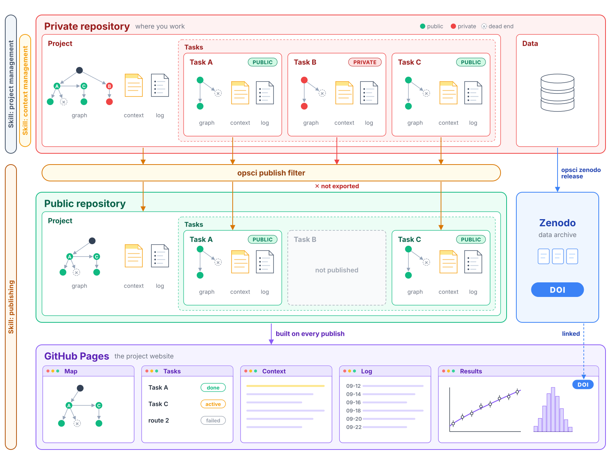

# Get started

The way we do science is changing rapidly, but it is more important than ever to keep
science open.

open-science is a framework for doing research in the open:

- **A complete research record.** How the methods were developed, the results, the
  approaches that failed, and the source code, in a public repository and on a project
  website, with the data archived on Zenodo with a DOI.
- **You decide what goes public, and when.** You work in a private repository and can mark
  any task, file or dataset as private. Nothing is released until you choose to publish.
  Each release contains only the files you allow, is checked for private material and
  secrets, and needs your approval.
- **With or without agents.** It works the same whether an agent does a small part of the
  work, most of it, or none of it.



- **Context management for agentic work.** Agents keep a short context file for the project
  and for each task. They clear their conversation on their own and resume from that
  file, so a long session is not resent in full on every turn or after the prompt cache
  expires, which reduces usage. The same files let collaborators and other researchers
  pick up an ongoing project straight away.



Left: the context is over 250k tokens, so the agent saves its state to the task's context
file and the plugin clears the session and resumes it from that file. Right: the agent
submits a SLURM job, saves its state and clears; the idle session is woken when the job
leaves the queue and resumes from the context file. Clearing before a long wait matters
because the prompt cache expires while the session sits idle: waking a session that still
holds a long conversation would resend all of it uncached, which costs far more than a
fresh start from the context file.

## Install: the onboarding skill

The framework is installed with Claude Code, through the onboarding skill
`open-science:onboard`. Install the `open-science` plugin, then run the skill in Claude Code:

```bash
claude plugin marketplace add mhycheung/open-science   # or the path to a local checkout
claude plugin install open-science@open-science
```

Then, in a new Claude Code session, type `/open-science:onboard`.

The skill:

- checks what your machine already has (git identity, GitHub SSH access, tmux, SLURM,
  `opsci`, installed plugins, credentials files), and asks only what the checks cannot
  answer;
- asks which components you want, explaining each in plain language, and installs their
  plugins with `claude plugin install <plugin>@open-science`;
- installs the `opsci` command if it is missing (it needs Python 3.11 or later, or pixi);
- with context management, sets up tmux for mouse use and explains how to arrange your work
  in it (see [Working in tmux](tmux.md)); on a SLURM cluster, it can also write a batch job
  that keeps a tmux session running on a compute node;
- sets up GitHub access, notifications (Notion, Slack or files) and Zenodo tokens.

It changes none of your settings (git config, Claude settings, `~/.tmux.conf`, file modes)
without a yes to that change, and it never asks you to paste a token into the chat: tokens
are written by a script that you run in a terminal of your own. New plugins load only in a
new Claude Code session. Run `/open-science:onboard` again to add components later.

Every step the skills run is also a command of `opsci`, which you can run yourself; see
[The opsci command](cli.md).

## Components

The framework has three components. Use any combination; each works without the others,
except context management, which needs project management. Project management and
publishing are used through `opsci` and plain files; their Claude Code plugins are optional.
Context management exists for Claude Code sessions. One more plugin, `open-science`, holds
the onboarding skill.

| # | component | what it does | pages |
|---|---|---|---|
| 1 | project management: the project template and the `open-science-project` plugin | the layout every project is copied from (description, tasks, map, rules, citations, context files, publish settings), and skills to create a project, start tasks, keep context files under their caps, migrate an old project, and take template updates | [Project template and layout](project-template.md), [Project skills](project-skills.md) |
| 2 | context management: the `open-science-context` plugin, for agents | Claude Code agents clear their own conversation and resume from the context files ("session jumps"); Claude Code must run inside tmux | [Context management and session jumps](context-management.md), [Working in tmux](tmux.md) |
| 3 | publishing: `opsci publish` and the `open-science-publish` plugin | the checked, user-approved export to a public repository, the project website, and Zenodo data releases | [Publishing and the filter](publishing.md), [Zenodo releases](zenodo.md) |

Also part of the framework:

| part | what it does | page |
|---|---|---|
| `opsci` command | the command-line tool behind every step, run by you or by the skills: map build, tasks, context caps, publish, site, Zenodo, notifications, Notion | [The opsci command](cli.md), [Notifications](notify.md), [Notion](notion.md) |
| `open-science` plugin | the onboarding skill `open-science:onboard` | this page |

Two optional extras live in `extras/` of the repository; nothing in the three components
depends on them: a [personal projects page](projects-page.md) that lists your projects on
your GitHub Pages site, and [SLURM resurrection](slurm-resurrect.md), for development on a
compute node of a computing cluster that uses the SLURM scheduler: it resumes your Claude
Code sessions in a new batch job when the current one reaches its time limit.

## How a project is laid out and published

How to read the figure at the top of this page:

- **Private project repository.** Everything is committed here, including drafts, private
  notes and failed routes. Only files listed under `include` in `publish/manifest.yaml` can
  leave it, and a task directory leaves only if its node header says `privacy: public`. A
  `soft-private` task is left out of the release and the public map but may be mentioned by
  name; a `hard-private` task may not appear anywhere in the release. See
  [Project template and layout](project-template.md).
- **The filter.** `opsci publish check` exports one commit, runs every check, and writes a
  report. If you use an agent, it adds a review of tone and claims. Nothing is pushed until you approve that export by its
  id. See [Publishing and the filter](publishing.md).
- **Public outputs.** `opsci publish push` copies the approved export into the public
  repository as a new commit, so the private history never reaches it. The public repository
  builds the project website on GitHub Pages. Data in `data/` never goes to the public
  repository; it can be released on Zenodo with a DOI, after you confirm the release. Your
  personal projects page links to all three.
