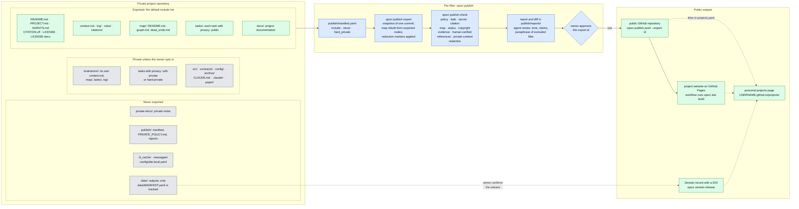

# Get started

open-science is a framework for running a research project with Claude Code so that the
project can be published openly. Plans, results, failed routes and sources are written down
in a fixed layout, so that the work can be reproduced and checked. You and the agents work in
a private repository. A public copy is made only through a checked export: it contains only
the files you allow, it is scanned for private material, and nothing is pushed until you
approve the exact export.

Agents keep short "current state" files (`context.md` for the project,
`tasks/<id>/context.md` for each task), so any session, or any person, can pick up the work
from them.

## The best way to start: the onboarding skill

The best way to get started is the onboarding skill, `open-science:onboard`. Install the
`open-science` plugin, then run the skill in Claude Code:

```bash
claude plugin marketplace add mhycheung/open-science   # or the path to a local checkout
claude plugin install open-science@open-science
```

Then, in a new Claude Code session, type `/open-science:onboard`.

The skill:

- checks what your machine already has (git identity, GitHub SSH access, tmux, SLURM,
  `opsci`, installed plugins, credentials files), and asks only what the checks cannot
  answer;
- asks which components you want, explaining each in plain language, and installs their
  plugins with `claude plugin install <plugin>@open-science`;
- installs the `opsci` command if it is missing (it needs Python 3.11 or later, or pixi);
- sets up GitHub access, notifications (files or Slack) and Zenodo tokens.

It changes none of your settings (git config, Claude settings, `~/.tmux.conf`, file modes)
without a yes to that change, and it never asks you to paste a token into the chat: tokens
are written by a script that you run in a terminal of your own. New plugins load only in a
new Claude Code session. Run `/open-science:onboard` again to add components later.

To install by hand instead, see "By hand" in the repository's `README.md`.

## Components

The framework has five components. Use any combination; each works without the others,
except context management, which needs the project structure. Four of them are Claude Code
plugins; the projects list has no plugin. A fifth plugin, `open-science`, holds the
onboarding skill.

| component | what it does | page |
|---|---|---|
| project template | the layout every project is copied from: description, tasks, map, rules, citations, context files, publish settings | [Project template and layout](project-template.md) |
| `open-science-project` plugin (project structure) | skills to create a project, start tasks, keep context files under their caps, migrate an old project, and take template updates | [Project skills](project-skills.md) |
| `open-science-context` plugin (context management) | agents clear their own conversation and resume from the context files ("session jumps"); needs tmux | [Context management and session jumps](context-management.md) |
| `open-science-publish` plugin (publishing) | the checked, owner-approved export to a public repository, the project website, and Zenodo data releases | [Publishing and the filter](publishing.md), [Zenodo releases](zenodo.md) |
| personal projects page (projects list) | one page on your personal GitHub Pages site that lists your projects | [Personal projects page](projects-page.md) |
| `slurm-resurrect` plugin (optional) | when a SLURM job reaches its time limit, rebuilds the tmux session in a new job and resumes its Claude sessions | [SLURM resurrection](slurm-resurrect.md) |
| `open-science` plugin | the onboarding skill `open-science:onboard` | this page |
| `opsci` command | the command-line tool the skills call: map build, tasks, context caps, publish, site, Zenodo, notifications | [The opsci command](cli.md), [Notifications](notify.md) |

## How a project is laid out and published

The chart shows a project made from the template, the filter that decides what leaves the
private repository, and where the public outputs go. Grey boxes stay private.



How to read it:

- **Private project repository.** Everything is committed here, including drafts, private
  notes and failed routes. Only files listed under `include` in `publish/manifest.yaml` can
  leave it, and a task directory leaves only if its node header says `privacy: public`. A
  `soft-private` task is left out of the release and the public map but may be mentioned by
  name; a `hard-private` task may not appear anywhere in the release. See
  [Project template and layout](project-template.md).
- **The filter.** `opsci publish check` exports one commit, runs every check, and writes a
  report. The agent adds its review. Nothing is pushed until you approve that export by its
  id. See [Publishing and the filter](publishing.md).
- **Public outputs.** `opsci publish push` copies the approved export into the public
  repository as a new commit, so the private history never reaches it. The public repository
  builds the project website on GitHub Pages. Data in `data/` never goes to the public
  repository; it can be released on Zenodo with a DOI, after you confirm the release. Your
  personal projects page links to all three.
