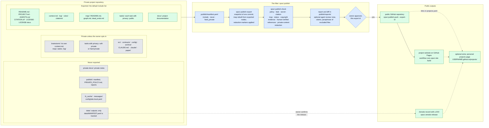

# Get started

open-science is a set of tools for doing research in the open. You work in a private
repository, where drafts, notes and failed attempts are all committed. From it you publish a
public record of the project: what you did and why, the results, the routes that failed, the
sources, and the data, released on Zenodo with a DOI. A public copy is made only through a
checked export: it contains only the files you allow, it is scanned for private material and
secrets, and nothing is pushed until you approve the exact export.

Plans, results and sources are written in a fixed layout, and each project and task keeps a
short "current state" file (`context.md` for the project, `tasks/<id>/context.md` for each
task), so that anyone, a collaborator, a reader, or you a year later, can pick up the work
and check it.

You do not need an AI agent to use any of this. A project is plain files in git, and every
step is a command of the `opsci` tool. If you use Claude Code, plugins add skills that run
the same steps with you, and optional components that help agents keep track of long work.

## Start without an agent

Clone the repository, install `opsci` from the clone (Python 3.11 or later), and create a
project:

```bash
git clone https://github.com/mhycheung/open-science.git
pip install -e open-science/tools
opsci template instantiate my-project --name my-project --title "My project" --author "Your Name"
cd my-project && git init
opsci task new --title "First question" first-question
opsci map build
```

Then read [Project template and layout](project-template.md) for what goes where, and
[Publishing and the filter](publishing.md) for `opsci publish check` and
`opsci publish push`. All commands are listed in [The opsci command](cli.md).

## Start with Claude Code: the onboarding skill

If you use Claude Code, the best way to get started is the onboarding skill,
`open-science:onboard`. Install the `open-science` plugin, then run the skill in Claude Code:

```bash
claude plugin marketplace add mhycheung/open-science   # or the path to a local checkout
claude plugin install open-science@open-science
```

Then, in a new Claude Code session, type `/open-science:onboard`.

The skill:

- checks what your machine already has (git identity, GitHub SSH access, tmux, SLURM,
  `opsci`, installed plugins, credentials files), and asks only what the checks cannot
  answer;
- asks which components you want, explaining each in plain language, and installs their
  plugins with `claude plugin install <plugin>@open-science`;
- installs the `opsci` command if it is missing (it needs Python 3.11 or later, or pixi);
- sets up GitHub access, notifications (files or Slack) and Zenodo tokens.

It changes none of your settings (git config, Claude settings, `~/.tmux.conf`, file modes)
without a yes to that change, and it never asks you to paste a token into the chat: tokens
are written by a script that you run in a terminal of your own. New plugins load only in a
new Claude Code session. Run `/open-science:onboard` again to add components later.

To install the plugins by hand instead, see "With Claude Code, by hand" in the repository's
`README.md`.

## Components

The framework has three components. Use any combination; each works without the others,
except context management, which needs project management. Project management and
publishing are used through `opsci` and plain files; their Claude Code plugins are optional.
Context management exists for Claude Code sessions. One more plugin, `open-science`, holds
the onboarding skill.

| # | component | what it does | pages |
|---|---|---|---|
| 1 | project management: the project template and the `open-science-project` plugin | the layout every project is copied from (description, tasks, map, rules, citations, context files, publish settings), and skills to create a project, start tasks, keep context files under their caps, migrate an old project, and take template updates | [Project template and layout](project-template.md), [Project skills](project-skills.md) |
| 2 | context management: the `open-science-context` plugin, for agents | Claude Code agents clear their own conversation and resume from the context files ("session jumps"); needs tmux | [Context management and session jumps](context-management.md) |
| 3 | publishing: `opsci publish` and the `open-science-publish` plugin | the checked, owner-approved export to a public repository, the project website, and Zenodo data releases | [Publishing and the filter](publishing.md), [Zenodo releases](zenodo.md) |

Also part of the framework:

| part | what it does | page |
|---|---|---|
| `opsci` command | the command-line tool behind every step, run by you or by the skills: map build, tasks, context caps, publish, site, Zenodo, notifications | [The opsci command](cli.md), [Notifications](notify.md) |
| `open-science` plugin | the onboarding skill `open-science:onboard` | this page |

Two optional extras live in `extras/` of the repository; nothing in the three components
depends on them: a [personal projects page](projects-page.md) that lists your projects on
your GitHub Pages site, and [SLURM resurrection](slurm-resurrect.md), which resumes Claude
Code sessions in a new SLURM job when the current one reaches its time limit.

## How a project is laid out and published

The chart shows a project made from the template, the filter that decides what leaves the
private repository, and where the public outputs go. Grey boxes stay private.



How to read it:

- **Private project repository.** Everything is committed here, including drafts, private
  notes and failed routes. Only files listed under `include` in `publish/manifest.yaml` can
  leave it, and a task directory leaves only if its node header says `privacy: public`. A
  `soft-private` task is left out of the release and the public map but may be mentioned by
  name; a `hard-private` task may not appear anywhere in the release. See
  [Project template and layout](project-template.md).
- **The filter.** `opsci publish check` exports one commit, runs every check, and writes a
  report. If you use an agent, it adds a review of tone and claims. Nothing is pushed until you approve that export by its
  id. See [Publishing and the filter](publishing.md).
- **Public outputs.** `opsci publish push` copies the approved export into the public
  repository as a new commit, so the private history never reaches it. The public repository
  builds the project website on GitHub Pages. Data in `data/` never goes to the public
  repository; it can be released on Zenodo with a DOI, after you confirm the release. Your
  personal projects page links to all three.
