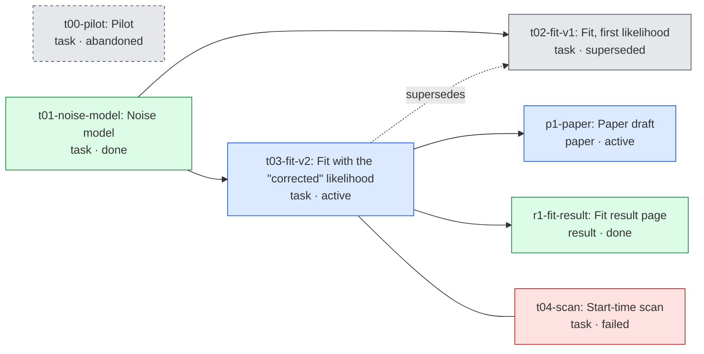

<!-- GENERATED by `opsci map build` from the node headers. Do not edit this file; edit the headers. -->

# Project graph

Arrows: `A --> B` means B depends on A. Dotted arrows point from the new node to the
node it supersedes. Plain lines join related nodes. Colour shows the status.

## Nodes

| id | type | status | verification | summary |
|---|---|---|---|---|
| [p1-paper](../paper/node.yaml) | paper | active | unverified | Paper on the corrected fit. |
| [r1-fit-result](../site/results/fit.md) | result | done | unverified | Posterior of the corrected fit. |
| [t00-pilot](../archive/t00-pilot/context.md) | task | abandoned | unverified | Pilot on simulated data only; not continued. |
| [t01-noise-model](../tasks/t01-noise-model/context.md) | task | done | verified | Gaussian noise model fixed from off-source data. |
| [t02-fit-v1](../tasks/t02-fit-v1/context.md) | task | superseded | unverified | Likelihood omitted the window normalisation \| biased amplitudes. |
| [t03-fit-v2](../tasks/t03-fit-v2/context.md) | task | active | unverified | Refit with the normalised likelihood. |
| [t04-scan](../tasks/t04-scan/context.md) | task | failed | unverified | Scan unstable below 10 ms; route dropped. |
